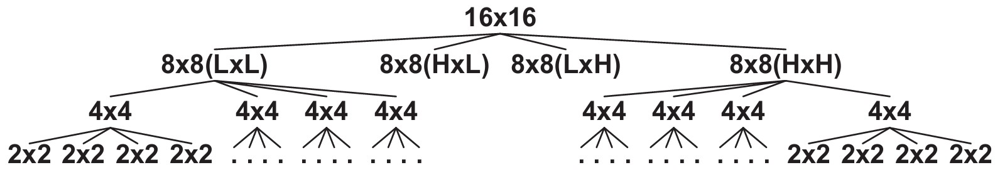

# Hardware Implementation: Approximate Multiplier IP

This directory contains the Register-Transfer Level (RTL) implementation, synthesis scripts, and standalone benchmarking tools for the Configurable Approximate Multiplier IP. 

While the root directory handles full System-on-Chip (SoC) integration with the PicoRV32 CPU, this folder is strictly dedicated to generating, verifying, and profiling the isolated approximate multiplier.

## Directory Structure

* **`ADD/`**: Contains the core adders used to sum partial products. Include the approximate 1-bit and n-bit adders.
* **`MUL/`**: Contains the recursive multiplier stages (`2x2`, `4x4`, `8x8`, `16x16`). Each level instantiates four smaller multipliers and sums their results. Includes both exact and approximate variants.
* **`PCPI/`**: Contains `pcpi.v`, the Pico Co-Processor Interface wrapper. This is a purely combinational, 1-cycle interface that handles the handshake with the PicoRV32 CPU.
* **`REF/`**: Contains the Python golden reference models. These scripts generate accurate mathematical baselines used to verify the Verilog implementations in simulation.
* **`synth/`**: Autogenerated directory where `make` deposits the final, flattened IP core (`custom_mul.v`) and NextPNR benchmark artifacts.

## Architecture & Configuration

The multiplier is based on a recursive structure. A 16x16 multiplier is built from four 8x8 multipliers, which are built from four 4x4 multipliers, down to the base 2x2 blocks. 



The architecture is highly parameterized, allowing configuration of the exact number of bits that utilize approximate logic at each stage of the tree using environment variables:

* **`N16`**: Number of bits using approximate adders in the 16x16 summation stage.
* **`N8`**: Number of bits using approximate adders in the 8x8 summation stage.
* **`N4`**: Number of bits using approximate adders in the 4x4 summation stage.

If you want to try out other designs from the paper *"Architectural-Space Exploration of Approximate Multipliers"* by Rehman et al. you can exchange the elementary multiplier (`MUL/2x2/Approx2x2Mul.v`) and adder (`ADD/OneBit/ApproxAddOneBit.v`) modules. 

**Example Configurations:**
* `N16=0 N8=0 N4=0`: Fully accurate standard multiplier.
* `N16=16 N8=8 N4=4`: Fully approximate multiplier (maximum resource savings, maximum error).

## The Build System

This directory utilizes a dedicated `Makefile` and a universal Yosys script (`global_synth.tcl`) to generate the IP core. 

### `make synth`
Flattens the entire hierarchy into a single, optimized Verilog file (`synth/custom_mul.v`) based on the `N*` parameters provided. This file is then picked up by the PicoSoC integration in the parent directory.

```bash
# Generate a partially approximate 16x16 multiplier IP
make synth N16=8 N8=4 N4=2
```

### `make pnr` (Out-of-Context Benchmarking)
Provides true, isolated hardware metrics (LUT consumption and $F_{max}$) for the multiplier tree without the PicoRV32 CPU acting as a routing bottleneck.

```bash
# Benchmark the hardware footprint of the exact multiplier
make pnr N16=0 N8=0 N4=0
```

Because the fully configured custom multiplier contains 134 I/O bits, it physically cannot fit on the iCE40UP5k FPGA (which only has 39 pins). If fed directly to the Place-and-Route (PnR) tool, synthesis will fail. Furthermore, if the inputs are left floating, Yosys will optimize the entire design away. To solve this, `make pnr` wraps the multiplier in `benchmark.v`.
