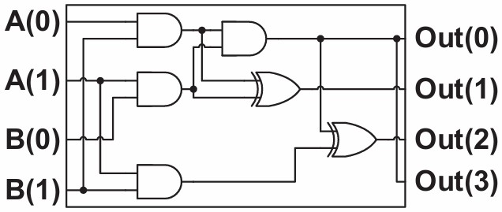
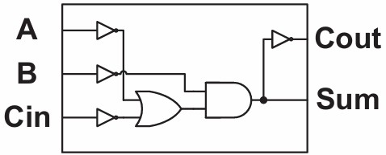

# PicoRV32 Approximate Multiplier

## Problem
In many embedded systems, efficient data processing is crucial. These systems often have stringent requirements for energy consumption and processing speed. While performing exact multiplications ensures high mathematical accuracy, it comes at the direct cost of increased power consumption, larger silicon area, and higher processing latency.

## Solution
Approximate computing provides a powerful approach for improving the efficiency of computationally intensive, error-tolerant tasks, such as image/video processing and filtering noisy sensor signals. By leveraging the capabilities of the iCEbreaker FPGA, we can prototype and evaluate these methods, achieving a tunable balance between performance and resource usage. This approach is particularly useful in power-constrained, real-time applications where a sacrifice in mathematical accuracy yields greater hardware efficiency.

Based on the work *"Architectural-Space Exploration of Approximate Multipliers"* by Rehman et al., this repository recursively implements a 16x16-bit multiplier based on their `ApproxMul_2` and `ApproxAdd_2` designs. 

The architecture is parameterized making the precision configurable. While the approximate adder design is used globally, the exact number of bits subjected to approximate 2x2 multiplication can be dynamically chosen during synthesis via the `N16`, `N8`, and `N4` environment variables:
- **`N4` / `N8` / `N16`**: Defines how many bits at the respective multiplier stage (4-bit, 8-bit, or 16-bit) utilize approximate logic. 
- **Example (Accurate 2x2 Multipliers)**: `N16=0 N8=0 N4=0` means all stages use exact multipliers.
- **Example (Mixed)**: `N16=0 N8=0 N4=2` means only the two lowest bits of the 4-bit stages use approximate multipliers.
- **Example (Highly Approximate)**: `N16=16 N8=8 N4=4` means all bits at all stages use approximate multiplication.




## Required Tools
- [OSS CAD suite](https://github.com/yosyshq/oss-cad-suite-build) (Includes Yosys, NextPNR, IceStorm, and Icarus Verilog)
- [Modified PicoRV32 Repository](https://github.com/sevjaeg/picorv32) (Integrated in the `picorv32` subdirectory)
- iCEbreaker FPGA board (Only required for physical testing)

## Project Structure
- `HW/`: Contains the RTL implementation of the approximate multiplier. Each subdirectory in `HW/MUL/` includes a test environment that dynamically compares the Verilog RTL output against a Python reference golden model (`HW/REF/`). The multiplier can either be synthesized using the main directory using `make mul-synth` or the one in the `HW/` directory using the local targets.
- `SW/`: Contains custom C software test programs to evaluate the instruction on the bare-metal CPU.
- `picorv32/`: The PicoRV32 softcore, modified to route our custom approximate multiply instruction through the Pico Co-Processor Interface (PCPI). The primary modifications reside in the `picorv32/picosoc/` directory (e.g., `firmware.c`, `picosoc.v`, `Makefile`).

## Continuous Integration

This repository uses two GitHub Actions workflows:

- **[`hw-sim-sweep.yml`](.github/workflows/hw-sim-sweep.yml)** runs automatically on every push and pull request. It sweeps every structurally distinct `N16`/`N8`/`N4` configuration per multiplier size and runs both the pre-synthesis (`make sim`) and post-synthesis (`make sim-synth`) testbenches against the Python golden model, failing the build on any mismatch. Results are summarized as a pass/fail table in the workflow run's job summary.
- **[`specs-table.yml`](.github/workflows/specs-table.yml)** is triggered manually. It recomputes accuracy metrics and place-and-route data (isolated multiplier and full SoC) for the four documented configurations, writes the results to `specs.csv`, regenerates the automated table in [Performance Results](#performance-results), and opens a pull request with the changes for review.

# Reproducing the Code

This repository features a master Makefile to quickly get started building various targets even without knowing the exact project structure. Typing `make help` in the root directory outlines the available targets.

To quickly synthesize the hardware and generate the SoC bitstream:
```sh
# Synthesize the exact multiplier and full SoC bitstream
make bitstream N16=0 N8=0 N4=0
```

Additionally, the system supports an Out-Of-Context (OOC) benchmark target (`make mul-pnr`) to determine the isolated maximum frequency ($F_{max}$) and resource usage (LUTs) of the multiplier across various approximate configurations, independent of the CPU bottleneck. Finally, `make prog` flashes the bitstream onto the physical iCEbreaker board.

To modify the hardware, look at the `HW/README.md` file first to get a good overview of the approximate multiplier implementation.

## Performance Results
The table below is regenerated from `specs.csv` by the "Update Specs Table" GitHub Actions workflow. LUT percentages are relative to the iCE40 UP5k's 5280 available logic cells (`ICESTORM_LC`). Latency is a constant 1 cycle for every configuration, since the PCPI interface (`HW/PCPI/pcpi.v`) is purely combinational.

<!-- SPECS_TABLE:START -->
| Metric | N16=0, N8=0, N4=0 | N16=16, N8=0, N4=0 | N16=16, N8=8, N4=0 | N16=16, N8=8, N4=4 |
|---|---|---|---|---|
| Mul LUTs | 686 (12%) | 670 (12%) | 510 (9%) | 394 (7%) |
| Total LUTs (PicoRV32 + Mul) | 4161 (78%) | 4082 (77%) | 3993 (75%) | 3910 (74%) |
| Isolated Fmax | 20.35 MHz | 16.95 MHz | 18.82 MHz | 20.55 MHz |
| System Clock (Fmax, PicoRV) | 18.62 MHz | 16.52 MHz | 17.41 MHz | 18.30 MHz |
| Median Relative Error | 3.4% | 3.4% | 4.7% | 21.5% |
| Max Relative Error | 99.9% | 428% | 136598% | 2587667% |
<!-- SPECS_TABLE:END -->

Mul LUTs drop with more approximation, by about 40% at the fully approximate configuration. Fmax does not follow the same clean trend. NextPNR's placement step uses a randomized heuristic search (simulated annealing) driven by an internal random-number generator. We do not use an explicitly fixed `--seed`, so each run starts that generator from a different state, and the same input netlist can end up placed differently on the FPGA fabric from run to run. Since achieved Fmax depends on the physical routing delays between placed cells rather than the logical design alone, that run-to-run placement variance propagates to the Fmax numbers. However, the dip at `N16=16, N8=0, N4=0` showed up consistently across multiple independent runs, suggesting that NextPNR finds this particular combination of approximate and exact adder stages harder to place and route well. On accuracy, median relative error stays low (3.4-4.7%) until `N4` approximation is enabled, where it jumps to 21.5%. The Max Relative Error is dominated by near-zero true products and should be read as a worst-case statistic, not typical behavior.

## Credits

**Students**:
- Paul Pölzl (NxN multipliers, scripting, integration of the python reference, CI workflows)
- Samir Hodzic (2x2 multiplier, adders, result visualization)
- Veronica Kimelman (PCPI interface, software, integration of the PicoRV32)

**Supervisors**:
- Christian Krieg
- Stefan Bajtala

## References
- PicoRV32 Core by [YosysHQ](https://github.com/YosysHQ/picorv32)
- Modified PicoSoC Environment by [Severin](https://github.com/sevjaeg/picorv32)
- Python Golden Model by [Stefan Bajtala](https://github.com/SteBaj/LDISPython)
